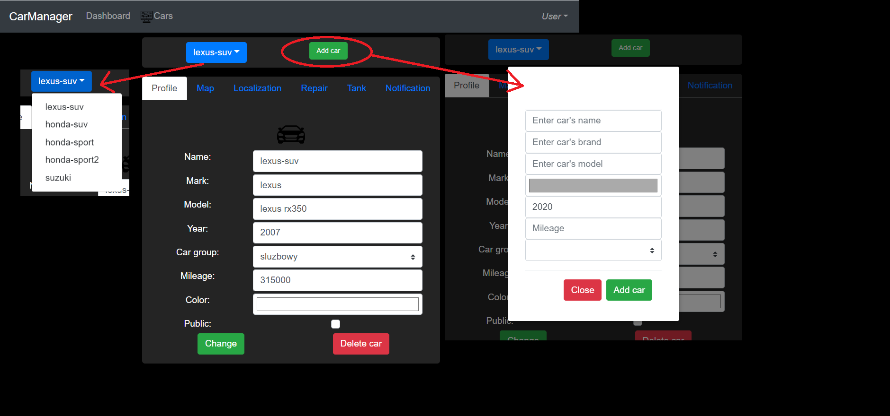
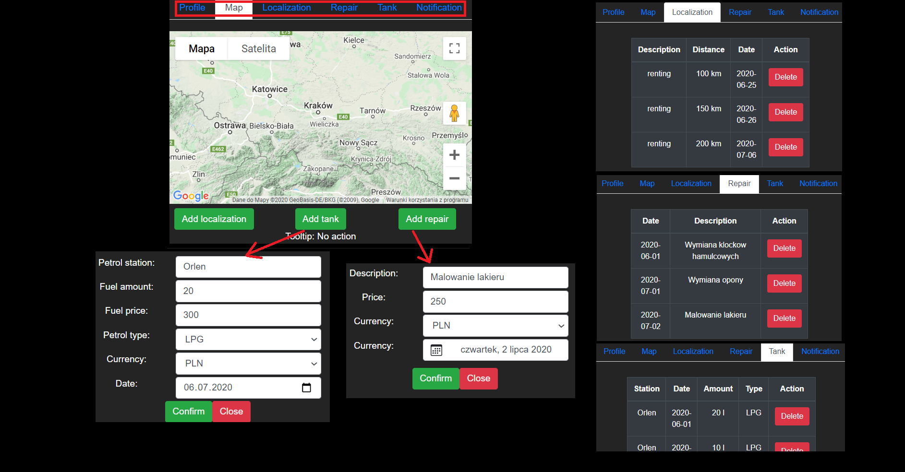
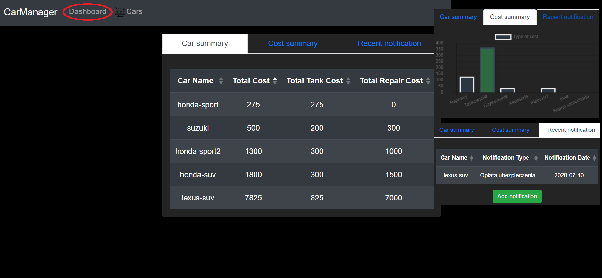
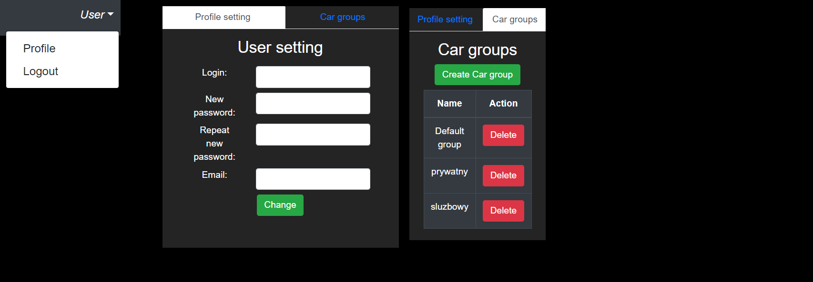

Celem aplikacji jest prowadzenie dziennika samochodów.

Główne funkcjonalności obejmują:

- Prowadzenie listy pojazdów
- Prowadzenie ewidencji napraw samochodów
- Prowadzenie ewidencji tankowania samochodu
- Prowadzenie historii lokalizacji pojazdu
- Prowadzenie dziennika kosztów pojazdów
- Podsumowanie (dashboard)

Po zalogowaniu do aplikacji użytkownik ma możliwość dodawania samochodów (przycisk ‘Add cars’) wprowadzając nazwę samochodu, markę, model, kolor, rocznik, przebieg oraz grupę w formularzu który wyświetla się w postaci modala.
Po dodaniu samochód aktualizuje się w bazie a wgląd mamy poprzez rozwijaną listę.
Informacje nadane na początku można modyfikować w zakładce ‘Profile’ wprowadzając daną zmianę i zapisując za pomocą przycisku ‘Change’.

Kolejne informacje jakie można wprowadzać to historia lokalizacji, naprawy ze specyfikacją czego one dotyczą i jaki jest ich koszt i w jakiej walucie, tankowanie z informacjami na jakiej stacji benzynowej, ile litrów, rodzaj paliwa, koszt (+waluta).
Wgląd do tych informacji jest w kolejnych zakładkach odpowiednio ‘Localization’, ‘Repair’ oraz ‘Tank’.
Możliwe jest też dodawanie powiadomień w zakładce ‘Notification’ dzięki czemu aplikacja będzie nas informować o zbliżających się wydarzeniach wprowadzonych przez nas - takich jak Przegląd rejestracyjny, opłata ubezpieczenia czy wymiana kół.

Kolejnym widokiem jest dashboard, gdzie znajdują się zebrane informacje podsumowujące koszty utrzymania samochodu, cost chart-wykres w kategorii kosztów (grupy: paliwo, naprawy itd) oraz recent notification (punkt zbiorczy dla powiadomień samochodów).

Użytkownik ma możliwość zmiany ustawień poprzez wejście w zakładkę ‘User’ w prawym górnym rogu i wybraniu zakładki ‘Profile’.
Umożliwia to zmianę danych użytkownika w ‘Profile setting’ – loginu, hasła, maila czy stworzenie nowej grupy samochodów w ‘Car groups’.

